# game-gl

游戏图形渲染模块，使用 LWJGL (Lightweight Java Game Library) 实现 OpenGL 渲染。

## 模块概述

本模块负责游戏的图形渲染、用户输入处理和 UI 交互，基于 GLFW 和 OpenGL 提供高性能的图形界面。

## 包结构

### com.algoblock.gl

主包，包含应用程序入口点。

### com.algoblock.gl.input

输入事件处理模块：

- `CharEvent` - 字符输入事件
- `KeyEvent` - 键盘按键事件
- `InputEvent` - 输入事件基类
- `InputEventQueue` - 输入事件队列
- `KeyMapper` - 按键映射器
- `PasteEvent` - 粘贴事件

### com.algoblock.gl.renderer

渲染器模块：

- `CursorRenderer` - 光标渲染器
- `DisplayTestPattern` - 显示测试图案
- `EffectsRenderer` - 特效渲染器
- `FontAtlas` - 字体图集管理
- `FontDiagnosticTestPattern` - 字体诊断测试
- `GlitchState` - 故障状态管理
- `RenderFrame` - 渲染帧
- `TerminalBuffer` - 终端缓冲区
- `TextRenderer` - 文本渲染器
- `UiEffect` - UI 特效

### com.algoblock.gl.services

业务服务：

- `CompletionService` - 自动补全服务

### com.algoblock.gl.ui

用户界面模块：

#### app

应用程序核心：

- `AppCmd` - 应用程序命令
- `AppCmdHandler` - 命令处理器
- `AppModel` - 应用程序模型
- `AppMsg` - 应用程序消息
- `AppProgram` - 应用程序程序

#### components

UI 组件：

- `CompleterComponent` - 自动补全组件
- `GlitchEffect` - 故障效果组件

#### pages

页面：

- `GamePage` - 游戏页面
- `StartPage` - 开始页面

#### tea

Tea 运行时（嵌入式脚本/配置语言）：

- `CmdHandler` - 命令处理器
- `Program` - 程序
- `TeaRuntime` - Tea 运行时
- `UpdateResult` - 更新结果

#### 其他

- `SyntaxHighlighter` - 语法高亮器

## 模块依赖图

```mermaid
classDiagram
    direction TB

    %% 外部依赖
    class Main {
        +init()
        +run()
    }

    class GameCoreService
    class BlockRegistry
    class Level
    class SubmissionResult

    %% input 包
    class InputEventQueue
    class KeyMapper
    class CharEvent
    class KeyEvent
    class PasteEvent

    %% renderer 包
    class RenderFrame {
        +width: int
        +height: int
        +terminalBuffer: TerminalBuffer
    }
    class TerminalBuffer
    class TextRenderer
    class CursorRenderer
    class FontAtlas
    class EffectsRenderer
    class UiEffect
    class GlitchState
    class DisplayTestPattern
    class FontDiagnosticTestPattern

    %% services 包
    class CompletionService

    %% ui.app 包
    class AppProgram
    class AppModel
    class AppCmd
    class AppCmdHandler
    class AppMsg

    %% ui.pages 包
    class StartPage
    class GamePage

    %% ui.components 包
    class CompleterComponent
    class GlitchEffect

    %% ui.tea 包
    class TeaRuntime
    class Program
    class CmdHandler
    class UpdateResult

    class SyntaxHighlighter

    %% 依赖关系
    Main --> GameCoreService
    Main --> LevelLoader
    Main --> InputEventQueue
    Main --> KeyMapper
    Main --> RenderFrame
    Main --> TerminalBuffer
    Main --> TextRenderer
    Main --> FontAtlas
    Main --> CursorRenderer
    Main --> DisplayTestPattern
    Main --> AppProgram
    Main --> TeaRuntime
    Main --> CompletionService

    AppProgram --> AppModel
    AppProgram --> RenderFrame
    AppProgram --> TerminalBuffer
    AppProgram --> Program
    AppProgram --> UpdateResult
    AppProgram --> StartPage
    AppProgram --> GamePage
    AppProgram --> Level

    AppModel --> Level
    AppModel --> StartPage
    AppModel --> GamePage

    AppCmdHandler --> GameCoreService
    AppCmdHandler --> SubmissionResult
    AppCmdHandler --> CmdHandler
    AppCmdHandler --> Player

    AppCmd --> Level

    StartPage --> KeyMapper
    StartPage --> RenderFrame
    StartPage --> TerminalBuffer
    StartPage --> Program
    StartPage --> UpdateResult
    StartPage --> GlitchEffect
    StartPage --> GlitchState
    StartPage --> UiEffect

    GamePage --> KeyMapper
    GamePage --> RenderFrame
    GamePage --> TerminalBuffer
    GamePage --> UiEffect
    GamePage --> CompletionService
    GamePage --> SyntaxHighlighter
    GamePage --> CompleterComponent
    GamePage --> Program
    GamePage --> UpdateResult
    GamePage --> Level
    GamePage --> SubmissionResult

    CompleterComponent --> TerminalBuffer
    CompleterComponent --> UpdateResult

    GlitchEffect --> GlitchState

    TeaRuntime --> RenderFrame
    TeaRuntime --> TerminalBuffer

    Program --> RenderFrame
    Program --> TerminalBuffer

    CompletionService --> BlockRegistry
    CompletionService --> BlockMeta
```



## 技术栈

- **LWJGL 3.3.4** - Java 游戏库
- **GLFW** - 窗口和输入管理
- **OpenGL** - 图形渲染
- **STB** - 字体纹理处理

## 构建依赖

```kotlin
implementation("org.lwjgl:lwjgl:3.3.4")
implementation("org.lwjgl:lwjgl-glfw:3.3.4")
implementation("org.lwjgl:lwjgl-opengl:3.3.4")
implementation("org.lwjgl:lwjgl-stb:3.3.4")
implementation("javazoom:jlayer:1.0.1")
```

## 约定

- 游戏窗口大小：1280x720
- 游戏窗口标题：AlgoBlock
- 游戏窗口背景颜色：#0D1117
- 主要颜色：#22CC22
- 文本颜色：#FFFFFF
- 灰度色01: #555555
- 灰度色02: #888888
